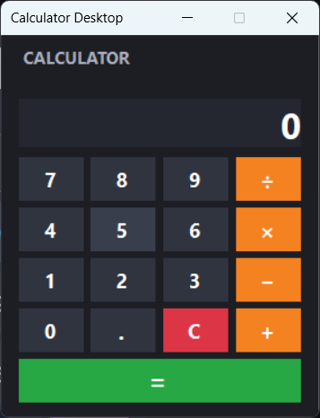
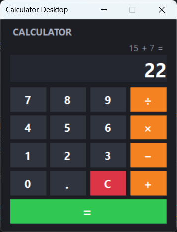
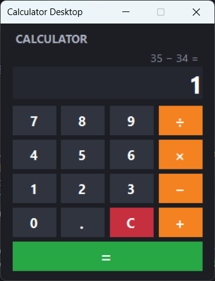
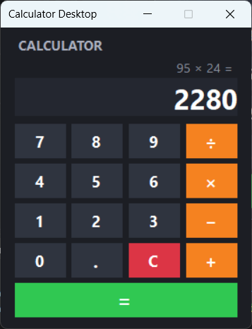
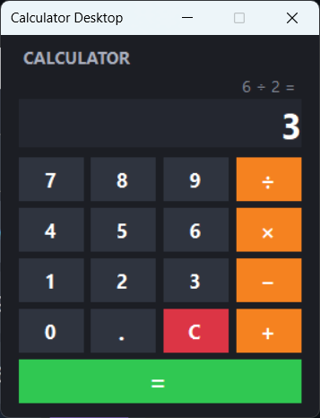
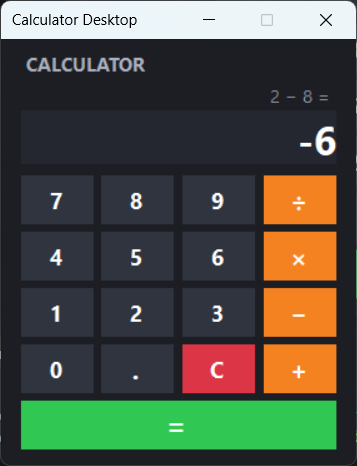
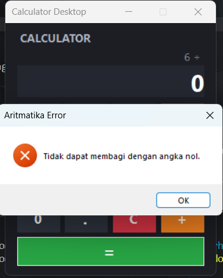

# Desktop Calculator App (C# Windows Forms)

Aplikasi kalkulator desktop sederhana yang dibangun menggunakan **C#**, **.NET**, dan **Windows Forms**. 

---

## Fitur Utama

- **Operasi Aritmatika Dasar**: Penjumlahan (`+`), Pengurangan (`−`), Perkalian (`×`), dan Pembagian (`÷`).
- **Dual Display (Status Operasi & Hasil)**:
  - Layar sekunder (`lblOperation`) untuk melacak ekspresi yang sedang aktif (contoh: `15 ×`).
  - Layar utama (`txtDisplay`) dengan font tebal dan besar untuk input serta hasil kalkulasi.
- **Unified Event Handling**: Menggunakan satu event handler terpusat untuk semua tombol digit (`0`–`9`) dan satu handler untuk seluruh tombol operator.
- **Error Handling & Validasi**:
  - Penanganan kasus pembagian dengan angka nol (*Divide by Zero*) menggunakan `try-catch`.
  - Dukungan angka desimal (`.`) yang mencegah input titik ganda.

---

## Struktur Project

```text
CalculatorApp/
│
├── Program.cs           # Titik awal eksekusi program (Main method)
├── Form1.cs             # Logika kalkulasi, event handler tombol, & validasi
├── Form1.Designer.cs    # Definisi tata letak kontrol, hierarki UI, & palet warna
```

---

## Cara Build dan Menjalankan Project

1. Inisialisasi project Windows Forms:
   ```bash
   dotnet new winforms -n CalculatorSederhana
   ```

2. Masuk ke folder project:
   ```bash
   cd CalculatorSederhana
   ```

3. Jalankan aplikasi:
   ```bash
   dotnet run
   ```

---

## Skenario Pengujian

| Kasus Uji     | Langkah Pengujian              | Expected Output                  | Status  |
|---------------|---------------------------------|-----------------------------------|---------|
| Penjumlahan   | Tekan `15` → `+` → `7` → `=`    | `22`                              | Sesuai  |
| Pengurangan   | Tekan `34` → `−` → `33` → `=`   | `1`                               | Sesuai  |
| Perkalian     | Tekan `95` → `×` → `24` → `=`   | `2280`                            | Sesuai  |
| Pembagian     | Tekan `6` → `÷` → `2` → `=`     | `3`                               | Sesuai  |
| Desimal       | Tekan `9` → `×` → `6` → `=`     | `1.5`                             | Sesuai  |
| Bagi Nol      | Tekan `6` → `÷` → `0` → `=`     | Muncul dialog pesan error         | Sesuai  |
| Clear Display | Tekan angka acak → tekan `C`    | Layar kembali ke `0` & history bersih | Sesuai |

---

## Tampilan Aplikasi

1. Tampilan Utama 


2. Operasi Perhitungan
- Pertambahan

- Pengurangan

- Perkalian

- Pembagian


3. Hasil Negatif dan Desimal
- Hasil Negatif

- Hasil Desimal


3. Penanganan Error (Pembagian Nol / Invalid)


## 📝 Catatan Implementasi

- **`object sender`**: Digunakan untuk mengidentifikasi tombol mana yang memicu event sehingga kode logika tombol digit dan operator tidak perlu diduplikasi untuk setiap tombol.
- **Kondisi Berantai**: Setelah menekan tombol `=`, hasil dapat langsung dijadikan operand pertama (`firstNumber`) untuk operasi matematika berikutnya tanpa perlu mengetik ulang angka.