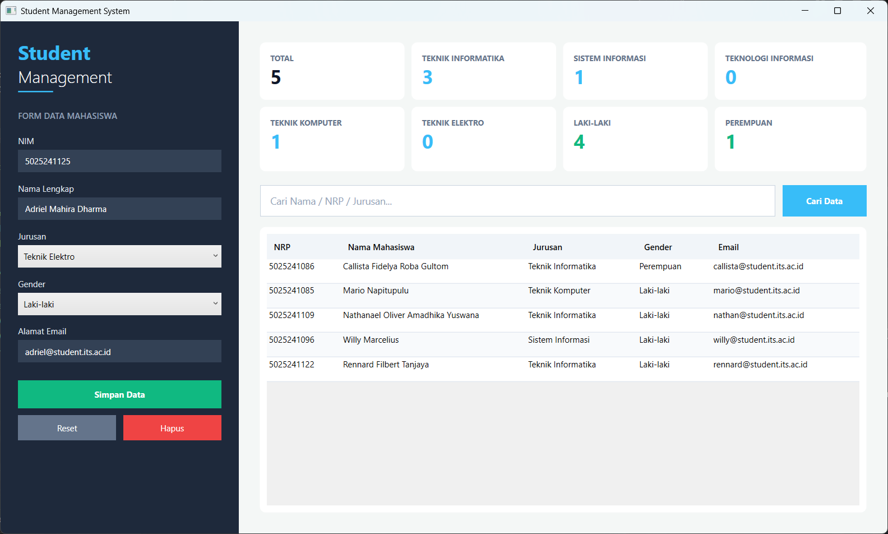
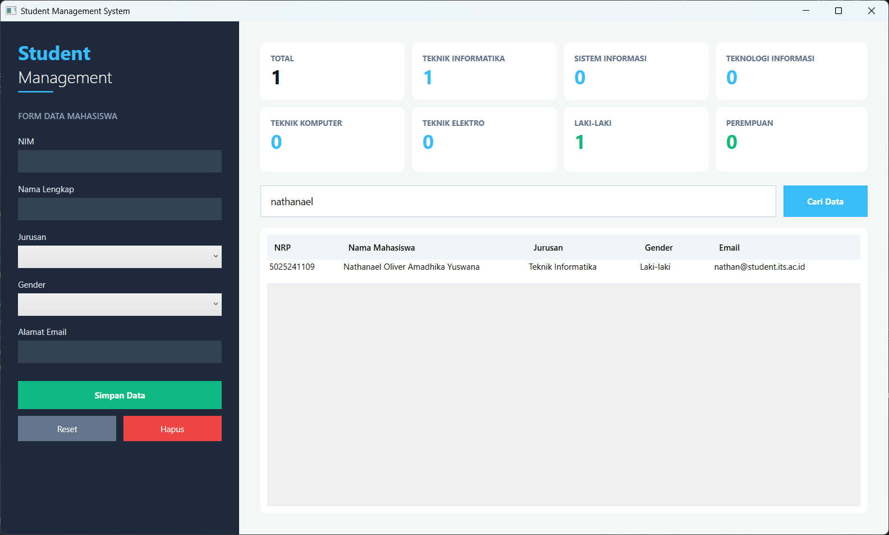
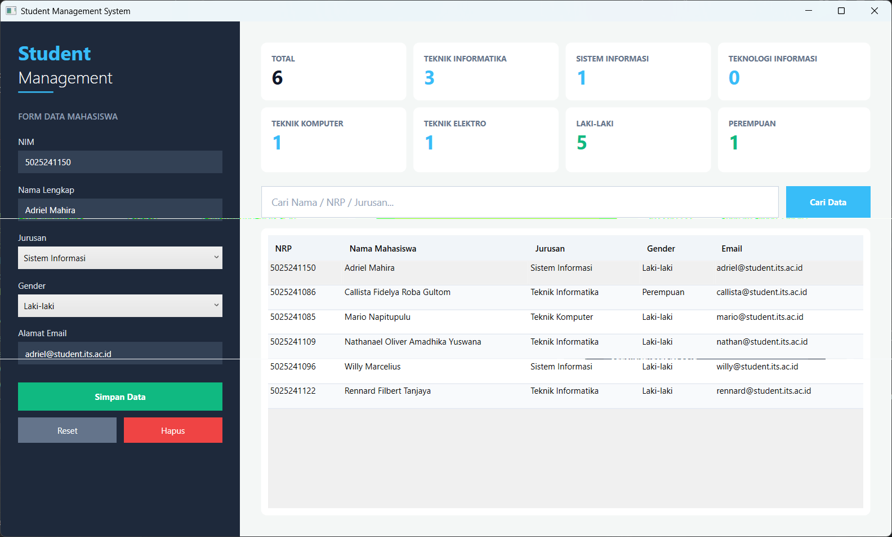
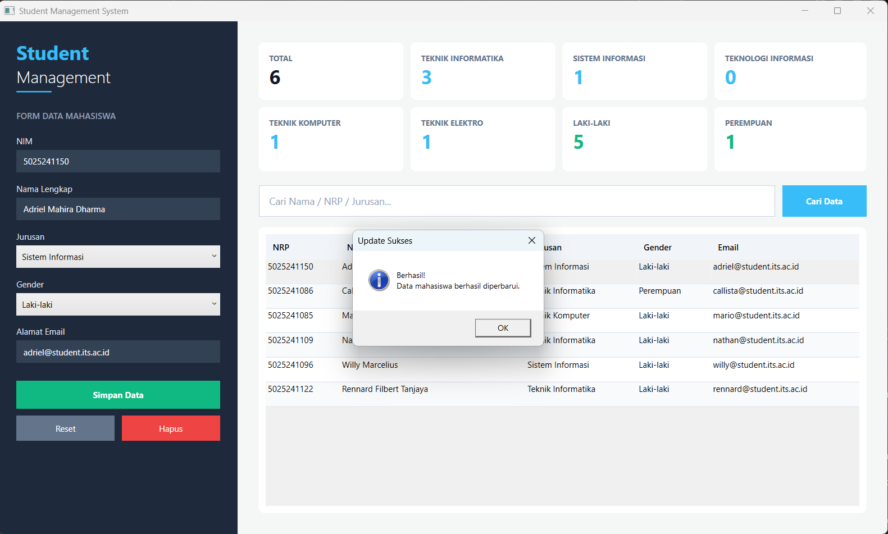
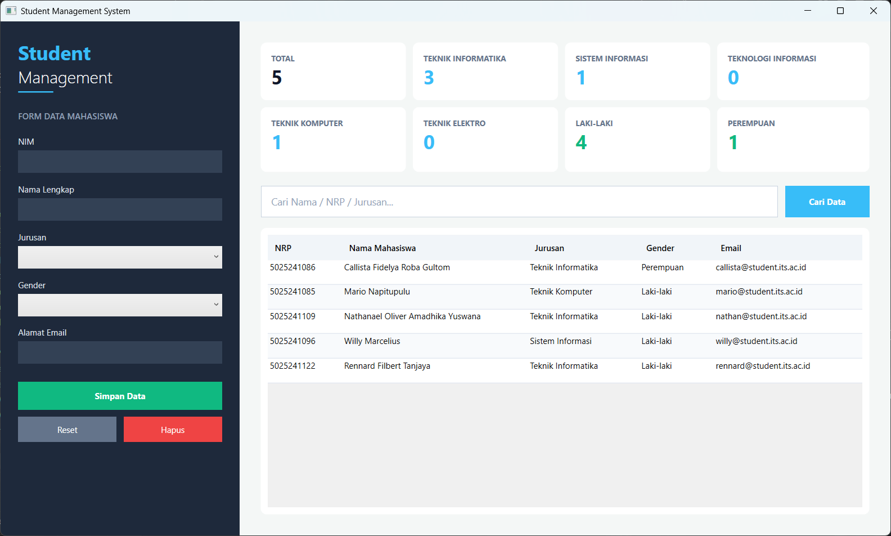
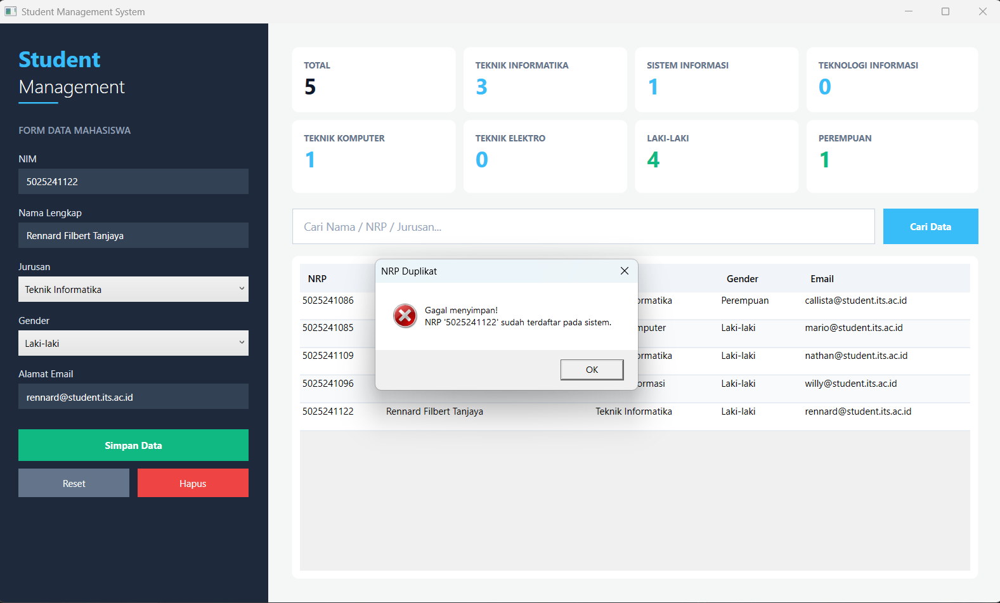
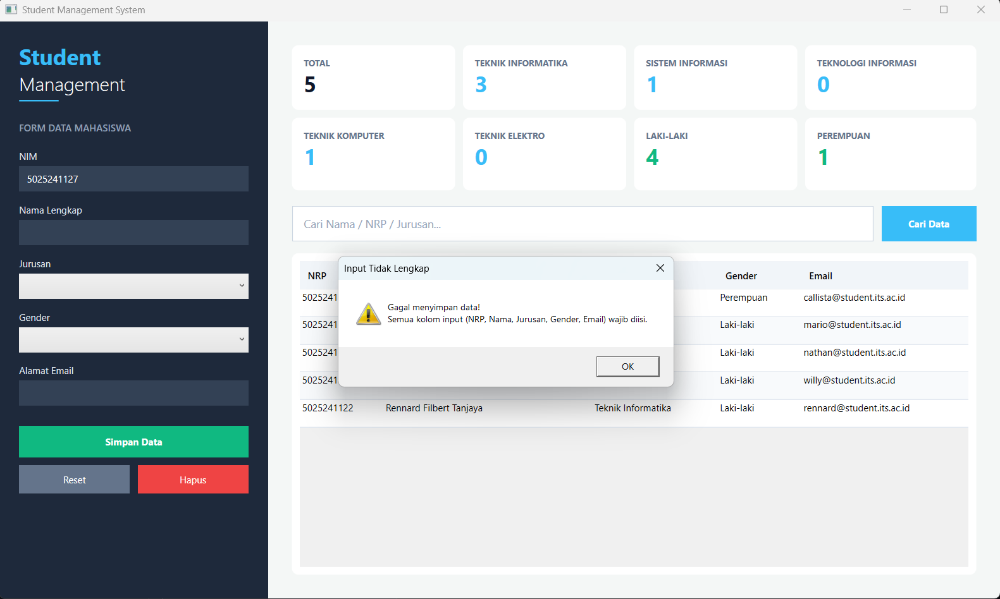

# Latihan 2 — Pemrograman Berbasis Kerangka Kerja (PBKK)

| Detail | Keterangan |
| --- | --- |
| **Nama Lengkap** | Rennard Filbert Tanjaya |
| **NRP** | 5025241122 |
| **Mata Kuliah** | Pemrograman Berbasis Kerangka Kerja |
| **Kelas** | D |

---

# Student Management System (C# WPF)

Aplikasi desktop pengelolaan data mahasiswa yang dibangun menggunakan **C#**, **.NET 8**, dan **WPF (Windows Presentation Foundation)** dengan menerapkan pola arsitektur **MVVM (Model-View-ViewModel)**.

---

## Fitur Utama

- **Manajemen Data Mahasiswa (CRUD)**
  Penambahan, pembaruan, dan penghapusan data mahasiswa meliputi NRP, Nama, Jurusan, Gender, dan Email.

- **Dashboard Statistik Interaktif**
  Kartu HUD real-time yang menghitung jumlah total mahasiswa, sebaran gender, serta statistik per jurusan (Teknik Informatika, Sistem Informasi, Teknologi Informasi, Teknik Komputer, dan Teknik Elektro).

- **Pencarian Dinamis**
  Bilah pencarian dengan petunjuk watermark (`Cari Nama / NRP / Jurusan...`) untuk memfilter data tabel secara instan.

- **Arsitektur MVVM & Data Binding**
  Pemisahan logika bisnis dan tampilan antarmuka menggunakan `RelayCommand` serta `INotifyPropertyChanged` tanpa bergantung pada click event konvensional.

---

## Struktur Project

```plaintext
StudentManager/
│
├── Data/
│   └── StudentRepository.cs    # Operasi data simulasi / penyimpanan mahasiswa
├── Models/
│   └── Student.cs              # Model entitas Student (NRP, Nama, Jurusan, Gender, Email)
├── ViewModels/
│   ├── RelayCommand.cs         # Implementasi ICommand untuk binding event tombol ke ViewModel
│   └── StudentViewModel.cs     # Logika bisnis, pemrosesan filter pencarian, & statistik
├── MainWindow.xaml             # Desain antarmuka UI (Dashboard, Form Sidebar, & DataGrid)
├── MainWindow.xaml.cs          # Code-behind untuk penautan DataContext ke ViewModel
└── App.xaml                    # Titik awal eksekusi aplikasi
└── App.xaml.cs                 # Titik awal eksekusi aplikasi
```

---

## Cara Build dan Menjalankan Project

1. **Inisialisasi project WPF:**

   ```bash
   dotnet new wpf -n StudentManager
   ```

2. **Masuk ke folder project:**

   ```bash
   cd StudentManager
   ```

3. **Jalankan aplikasi:**

   ```bash
   dotnet run
   ```

---

## Skenario Pengujian

| Kasus Uji | Langkah Pengujian | Expected Output | Status |
|---|---|---|---|
| Tambah Data Valid | Isi semua kolom input lengkap → klik `Simpan Data` | Pop-up *"Tambah Data Sukses"* muncul, data masuk tabel | Sesuai |
| Input Tidak Lengkap | Kosongkan salah satu/semua kolom → klik `Simpan Data` | Pop-up peringatan *"Input Tidak Lengkap"* muncul | Sesuai |
| NRP Duplikat | Masukkan NRP yang sudah ada di tabel → klik `Simpan Data` | Pop-up error *"NRP Duplikat"* muncul | Sesuai |
| Data Sama Persis | Masukkan seluruh data yang identik dengan baris lain → klik `Simpan Data` | Pop-up peringatan *"Data Duplikat"* muncul | Sesuai |
| Update Data | Pilih baris → ubah data → klik `Simpan Data` | Pop-up *"Update Sukses"* muncul, data terbarui | Sesuai |
| Hapus Data | Pilih baris → klik `Hapus` → konfirmasi `Ya` | Pop-up *"Hapus Sukses"* muncul, data terhapus | Sesuai |

---

## Tampilan Aplikasi

### Dashboard Utama


### Pengelolaan Data (CRUD)
1. Menambahkan data baru (Create)




2. Menampilkan Data (Read)



3. Memperbarui data yang sudah ada (Update)





4. Menghapus data (Delete)




### Penanganan Validasi & Peringatan Error
1. User tidak bisa menambahkan data baru yang sama persis dengan data yang ada sekarang



2. User tidak bisa input NRP yang sama


3. User tidak bisa menginput data yang tidak lengkap



---

## Catatan

- **MVVM Pattern**
  Memisahkan logika aplikasi di ViewModel dari tampilan XAML, menjadikan struktur kode lebih rapi, terorganisir, dan mudah dirawat.

- **Data Binding & INotifyPropertyChanged**
  Setiap perubahan pada data atau perhitungan statistik di ViewModel akan memperbarui tampilan UI secara otomatis.

- **RelayCommand**
  Digunakan untuk menghubungkan perintah aksi tombol XAML (Simpan, Hapus, Reset, Cari) langsung ke metode fungsional di ViewModel.